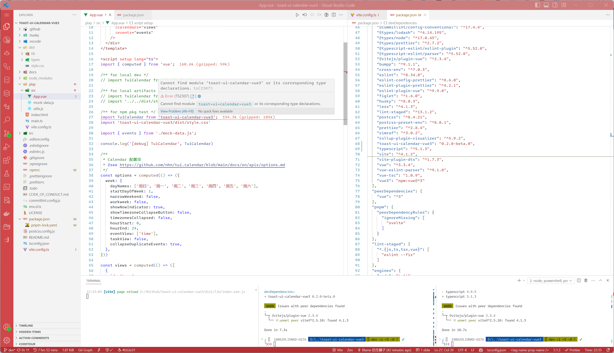

# @toast-ui/calendar（for vue3）

Simple `@toast-ui/calendar` wrapper for vue3, pr welcomes ~


## 📸 Run Dev

1. `pnpm install`
2. `pnpm serve`

## 📸 Usage

```vue
<template>
  <div class="play-container">
    <tui-calendar
      class="my-calendar"
      ref="calendarRef"
      view="week"
      :use-form-popup="true"
      :use-detail-popup="true"
      :week="options.week"
      :calendars="views"
      :events="events"
    />
  </div>
</template>

<script setup lang="ts">
import { computed } from 'vue';

import TuiCalendar from 'toast-ui-calendar-vue3';
import 'toast-ui-calendar-vue3/dist/style.css'

import { events } from './mock-data.js';

/**
 * Calendar 配置项
 * @see https://github.com/nhn/tui.calendar/blob/main/docs/en/apis/options.md
 */
const options = computed(() => ({
  week: {
    dayNames: ['周日', '周一', '周二', '周三', '周四', '周五', '周六'],
    startDayOfWeek: 1,
    narrowWeekend: false,
    workweek: false,
    showNowIndicator: true,
    showTimezoneCollapseButton: false,
    timezonesCollapsed: false,
    hourStart: 0,
    hourEnd: 24,
    eventView: ['time'],
    taskView: false,
    collapseDuplicateEvents: true,
  },
}))

const views = computed(() => ([
  {
    id: 'home',
    name: 'Home',
    backgroundColor: '#69ff7061',
    borderColor: '#69ff7061',
    dragBackgroundColor: '#69ff7061',
  },
  {
    id: 'work',
    name: 'Work',
    backgroundColor: '#2d9fff61',
    borderColor: '#2d9fff61',
    dragBackgroundColor: '#2d9fff61',
  },
]))
</script>

<style scoped>
.intro {
  max-width: clamp(60em, 62vw);
}
.play-container {
  display: flex;
  flex-direction: column;
  padding: 8px;
}
</style>

<style>
.my-calendar {
  border: solid 1px #eee;
  border-radius: 4px;

  .toastui-calendar-day-names {
    border: none !important;
  }
}
</style>
```

## 🚩 Help

type is down, help wanted



## 📄 License

MIT License
